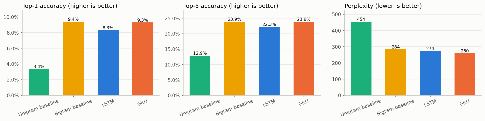
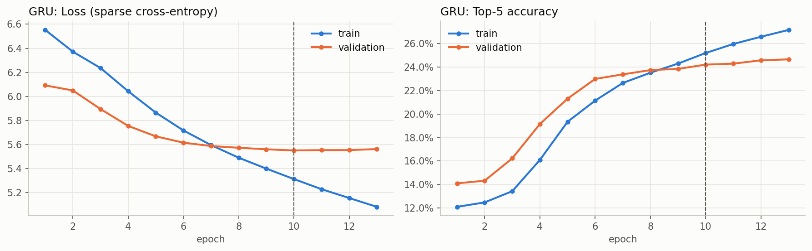
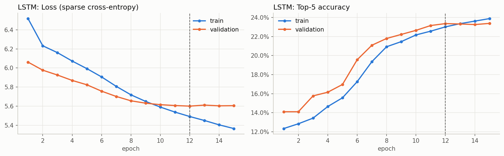
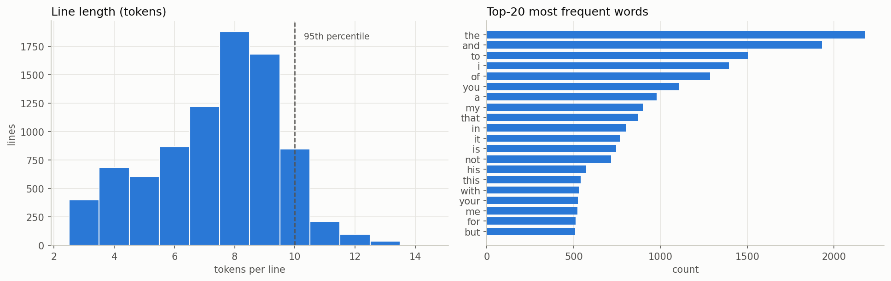

# 🧠 Next Word Prediction: LSTM vs GRU (v2)

[](https://colab.research.google.com/github/Adhiraj170204/Next-Word-Prediction/blob/main/notebooks/next_word_prediction.ipynb)

Next-word prediction is the task behind **autocomplete bars and predictive keyboards**: given the words typed so far, suggest the most likely next words. This project trains word-level recurrent models (LSTM and GRU) on three Shakespeare plays, compares them against simple n-gram baselines on a held-out test set, and serves the best model in a **Streamlit** app that shows the **top-5 suggestions** with their probabilities.

---

## 🔁 What changed in v2, and why

v1 reported a validation accuracy far below its training accuracy, and its evaluation leaked. v2 rebuilds the pipeline so the numbers are honest:

| v1 | v2 | Why |
| :--- | :--- | :--- |
| `train_test_split` on n-gram prefixes | **Split by line** (80/10/10, seed 42) *before* generating prefixes | Prefixes of the same line ended up in both train and validation, so validation partly measured memorisation. Splitting by line keeps every line in exactly one split. |
| Train ≫ val accuracy; EarlyStopping didn't effectively stop | Dropout 0.3 after **both** recurrent layers, vocabulary capped to words seen ≥ 2× in train, `EarlyStopping(patience=3, restore_best_weights=True)` + best-val-loss checkpoint; the actual stop epoch is logged | Reduces overfitting and guarantees the evaluated model is the best validation checkpoint |
| One-hot targets over the whole vocabulary | Integer targets + `sparse_categorical_crossentropy` | Same loss, far less memory |
| Top-1 accuracy only, no reference point | **Top-1, top-5 and perplexity** on a **test set used once**, vs. unigram and bigram baselines | Top-5 matches how autocomplete is used; baselines show whether the network actually learned anything |
| One play (*Hamlet*), LSTM only | *Hamlet*, *Macbeth*, *Julius Caesar*; **LSTM vs GRU** | More data; a controlled architecture comparison |
| Notebook outputs from another machine | Fresh, self-contained Colab notebook with cleared outputs | Reproducible end to end |

---

## 🔬 Pipeline

1. **Data**: NLTK Gutenberg `shakespeare-hamlet.txt`, `shakespeare-macbeth.txt` and `shakespeare-caesar.txt`. Lowercased; bracketed text, speaker tags and stage directions removed; lines with fewer than 3 tokens dropped.
2. **EDA**: token and vocabulary counts, line-length distribution, top-20 words.
3. **Split by line**: shuffle with seed 42, then 80 / 10 / 10 train / val / test.
4. **Tokenizer**: fit on **train only**, `<OOV>` token, vocabulary limited to words appearing ≥ 2 times in train. The OOV share of val/test tokens is reported.
5. **Sequences**: n-gram prefixes per line, pre-padded. The max length is the 95th percentile of train line lengths, and longer contexts are truncated from the left. Targets are integers.
6. **Baselines**: (a) always predict the most frequent word; (b) a bigram count model that falls back to (a).
7. **Models**: LSTM and GRU with identical architecture, trained for up to 50 epochs with early stopping.
8. **Evaluation on test (once)**: top-1, top-5, perplexity, parameter counts, training time, training curves.
9. **Qualitative check**: top-5 predictions for fixed prompts, shown as they come out.
10. **Artifacts**: `models/next_word_model.keras` (lowest validation loss), `models/tokenizer.pickle`, `results/metrics.json`, `results/figures/*.png`.

---

## 🏗️ Model architecture

Both models are identical except for the recurrent cell (`LSTM` or `GRU`):

```
Embedding(vocab_size, 100)
→ LSTM/GRU(150, return_sequences=True) → Dropout(0.3)
→ LSTM/GRU(100)                         → Dropout(0.3)
→ Dense(vocab_size, softmax)
```

- **Loss:** `sparse_categorical_crossentropy`
- **Optimizer:** Adam
- **Metrics:** accuracy, `SparseTopKCategoricalAccuracy(k=5)`
- **Callbacks:** `EarlyStopping(monitor="val_loss", patience=3, restore_best_weights=True)`, `ModelCheckpoint` (best `val_loss`)
- **Perplexity:** `exp(mean cross-entropy)` on the test set

The vocabulary size, sequence length and parameter counts depend on the data split and are written to `results/metrics.json` by the notebook.

---

## 📊 Results

Single training run on Colab (T4 GPU), seed 42. All metrics are on the **held-out test set** (853 lines → 4,801 next-word predictions), which was not used for training, early stopping or model selection. Full numbers are in [`results/metrics.json`](results/metrics.json).

### Test-set comparison

| Model | Top-1 accuracy | Top-5 accuracy | Perplexity ↓ | Parameters | Train time | Epochs run (best) |
| :--- | ---: | ---: | ---: | ---: | ---: | :---: |
| Unigram baseline (most frequent word) | 3.35% | 12.87% | 454.4 | – | – | – |
| Bigram baseline (count model) | **9.39%** | **23.89%** | 284.3 | – | – | – |
| LSTM | 8.31% | 22.27% | 274.4 | 828,272 | 57.6 s | 15 (12) |
| **GRU** (deployed) | 9.29% | **23.89%** | **259.8** | 766,272 | 45.5 s | 13 (10) |



### What the numbers say

- **The GRU is the best model, but only by a small margin over a bigram count model.** It ties the bigram baseline on top-5 accuracy, is 0.1 points lower on top-1, and is clearly better on perplexity (259.8 vs 284.3). In other words, the network assigns more probability to the correct word on average, but this rarely changes *which* words make the top 5.
- **The GRU beat the LSTM on every metric**, with about 7% fewer parameters and about 20% less training time. With roughly 40k training sequences, the simpler cell is the better fit.
- **Both models clearly beat the unigram floor**: top-5 nearly doubles and perplexity falls by about 40%.
- **Early stopping worked.** The LSTM stopped at epoch 15 and the GRU at epoch 13, out of a maximum of 50. The weights kept were from epochs 12 and 10, where validation loss was lowest.
- **The overfitting gap is gone.** At the kept epoch, train and validation top-5 accuracy are within about 1–2 points for both models (see the curves below). Training loss keeps falling after that while validation loss flattens, which is exactly where early stopping cuts in.
- **These numbers are not comparable to v1's.** v1's validation set leaked prefixes of training lines and v2 uses a different corpus, vocabulary and split, so v2's lower-looking figures are the honest ones.

### Training curves

| GRU | LSTM |
| :---: | :---: |
|  |  |

The dashed line marks the epoch whose weights were kept (lowest validation loss).

### Example predictions (GRU, top-5)

Shown unfiltered, good and bad:

| Prompt | Top-5 suggestions (probability) |
| :--- | :--- |
| `to be or not to` | the (4.4%), be (3.3%), this (2.6%), heare (2.1%), my (2.0%) |
| `my lord` | i (13.2%), you (5.2%), thou (5.2%), he (4.6%), it (4.1%) |
| `the king` | is (13.0%), of (9.6%), and (6.5%), to (3.8%), that (2.9%) |
| `what is` | a (11.7%), the (9.0%), my (5.2%), no (4.4%), not (4.2%) |
| `i will` | not (19.2%), be (7.5%), haue (3.3%), speake (1.6%), my (1.6%) |
| `good night` | is (10.2%), and (4.8%), to (3.9%), shall (3.3%), are (3.0%) |
| `o my` | lord (42.0%), selfe (3.2%), father (2.6%), good (2.0%), deere (1.2%) |
| `let us` | the (11.9%), you (5.4%), me (5.1%), him (4.8%), my (4.6%) |

The model has learned common local patterns (`o my` → *lord*, `i will` → *not*/*be*, `the king` → *is*/*of*). It hasn't memorised famous lines: `to be or not to` → *be* is only its 2nd guess at 3.3%. That's expected, because the line-level split means the model may never have seen that line, and the corpus is far too small for it to generalise to quotations. The archaic spellings (`heare`, `haue`, `selfe`, `deere`) come straight from the Gutenberg text.

### Dataset at a glance

8,530 lines and 63,349 tokens after cleaning (7,565 unique words, 4,218 of which appear only once). The vocabulary has 2,872 entries (words seen at least twice in train, plus padding and `<OOV>`). `<OOV>` makes up 7.6% of train tokens and about 11% of val/test tokens. Inputs are capped at 9 context words (the 95th-percentile line length is 10).



---

## 📂 Repository structure

```plaintext
Next-Word-Prediction/
├── notebooks/
│   └── next_word_prediction.ipynb   # Full pipeline: data → baselines → LSTM/GRU → evaluation → artifacts
├── app/
│   └── app.py                       # Streamlit app (top-5 suggestions)
├── models/                          # next_word_model.keras, tokenizer.pickle (produced by the notebook)
├── results/                         # metrics.json, figures/*.png (produced by the notebook)
├── nextword.jpg                     # Background image for the Streamlit UI
├── requirements.txt
├── LICENSE
└── README.md
```

---

## 🚀 Getting started

### 1. Train on Colab

1. Click the **Open in Colab** badge above.
2. Select *Runtime → Change runtime type → T4 GPU*.
3. Click *Runtime → Run all*. The last cells save the artifacts and download `next_word_prediction_artifacts.zip`.
4. Unzip it into the repository root, so that `models/` and `results/` sit next to `app/`.

### 2. Run the Streamlit app locally

```bash
git clone https://github.com/Adhiraj170204/Next-Word-Prediction.git
cd Next-Word-Prediction

python -m venv venv
# Windows: .\venv\Scripts\Activate.ps1    macOS/Linux: source venv/bin/activate
pip install -r requirements.txt

streamlit run app/app.py
```

Then open **http://localhost:8501**, type a few words, and click **Suggest Next Words**. The app reads `models/next_word_model.keras`, `models/tokenizer.pickle` and the max sequence length from `results/metrics.json`.

> **Windows note:** TensorFlow's install has very long file paths. If `pip install` fails with `No such file or directory` inside `site-packages\tensorflow\include`, enable [Windows long paths](https://learn.microsoft.com/windows/win32/fileio/maximum-file-path-limitation#enable-long-paths-in-windows-10-version-1607-and-later) or create the venv in a short path (e.g. `C:\venvs\nwp`).

---

## ⚠️ Limitations

- **Small corpus.** Three plays is tens of thousands of tokens, tiny by language-model standards, so absolute accuracy stays modest.
- **Archaic spelling.** Gutenberg's Elizabethan spelling (`haue`, `vpon`, `selfe`) splits words across several vocabulary entries, and the model doesn't transfer to modern English.
- **Word-level vocabulary.** Words outside the capped vocabulary become `<OOV>` and can never be suggested.
- **No subword tokenisation.** BPE/WordPiece would share statistics across related word forms and remove the OOV problem.
- **Short context.** Each line is modelled independently, capped at the 95th-percentile length.
- **Next step:** a small transformer with subword tokenisation (or fine-tuning a pretrained model such as GPT-2).

---

## 🛠️ Tech stack

TensorFlow / Keras · NLTK · NumPy · Pandas · Matplotlib · Streamlit

---

## 📄 License

This project is licensed under the terms described in the [LICENSE](LICENSE) file.
